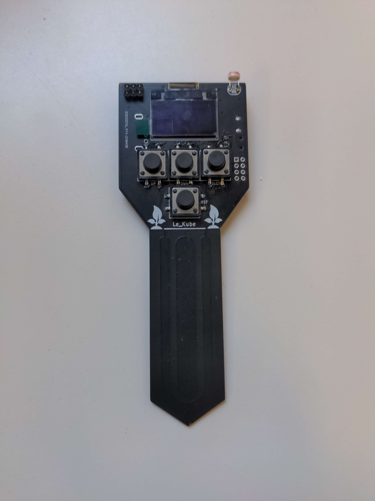
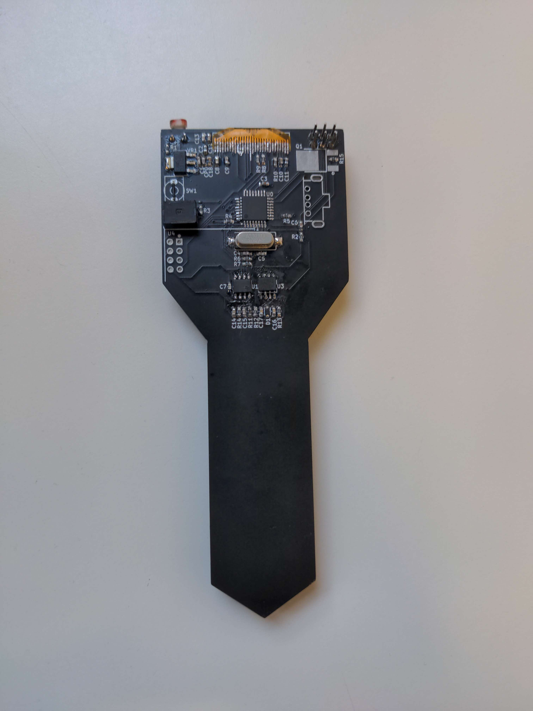
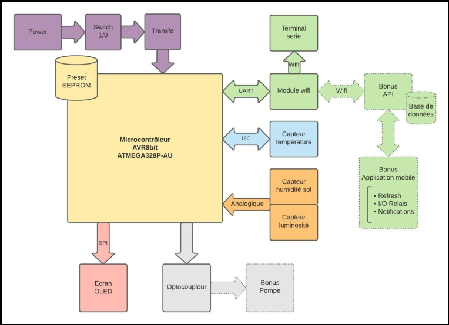
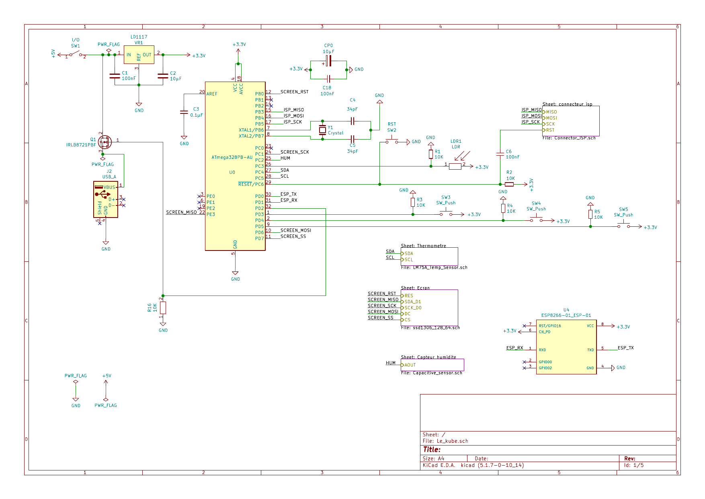

# Le Kube
Implementation of an IoT solution for growing plants.\
Development of the Bill of Materials (BOM), Specification Document, and PCB Fabrication. \
Electrical schematics, circuit design, and component soldering. \
Firmware development in C for Atmega328p and ESP328p microcontrollers, along with an Adafruit screen. \
Implementation of UART, SPI, and I2C protocols, AT command usage, EEPROM memory handling, timers, and interrupts. \
LAMP stack setup on Raspberry Pi with JavaScript and MySQL solutions. \

\
The data collected by the sensors are sent via wifi and accessible online, as well as on the Oled screen.
Variables monitored by the captors:
* `soil moisture
* `light
* `temperature
A water pump is connected to an optocoupler to automate the watering.

## Block diagram

## Electric diagram

